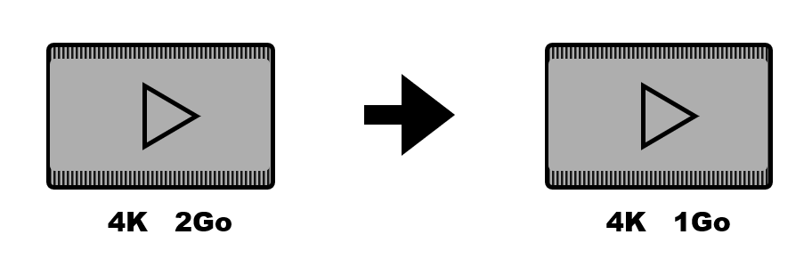
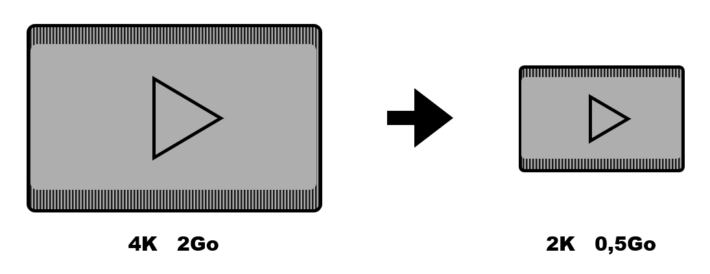
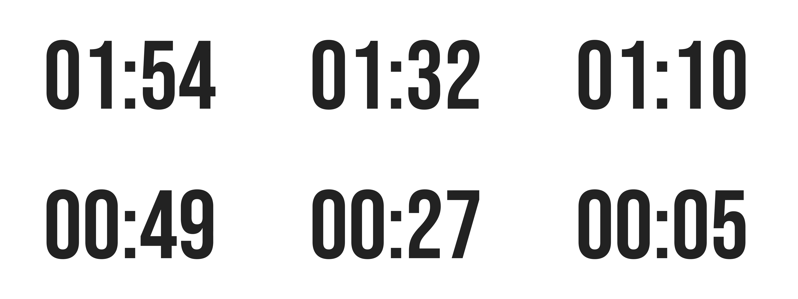
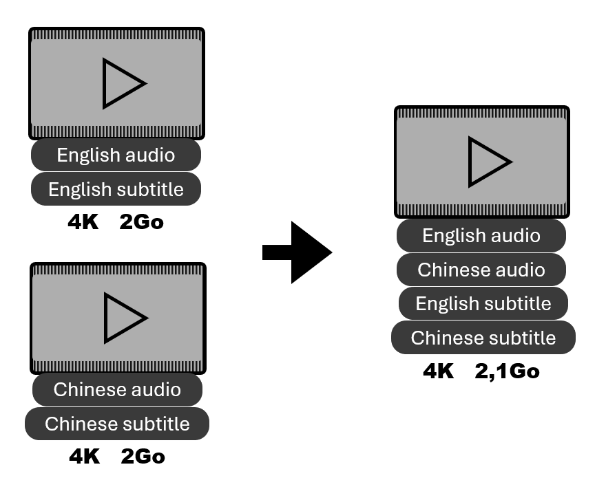
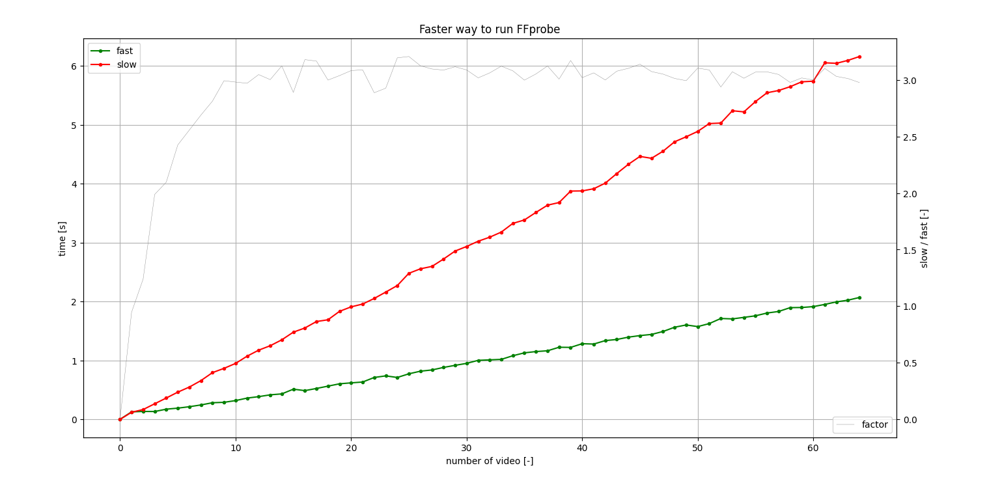

<div align="center">

#  VideoScripy

**English** | [**中文简体**](./README_CN.md)

**Quality preserved, Storage saved.**

Collection of video processes such as compression, upscale, interpolation and stream manipulation.


</div>


## Table of contents

- [Requirements](#requirements)
- [Embedded version](#embedded-version)
- [Self setup version](#self-setup-version)
- [Processes Description](#processes-description)
- [Benchmarking](#benchmarking)
- [Credits](#credits)


## Requirements

- Windows OS
- NVIDIA GPU for faster video process
- Atleast 50 Go disk space free for Upscale process | 10 Go for Interpolate process
- Python 3.10
- [Tools](#installation-1)


## Embedded version

Simplest. Python, Tools are already setup.  
Advantage : **Beginner-friendly**

### Installation

Download and extract the [Embedded release](https://github.com/luewh/Video-Script/releases/latest)

### Usage

Run the `VideoScripyWebUI.bat`


## Self setup version

Need to download the source codes, install Python and its dependencies, download tools and include them to tools folder or add them to PATH.    
Advantage : **Freedom**

### Installation

1. Download the source code and extract.

1. Download and install Python 3.10 if you dont have.

2. Install dependencies
    ```shell
    pip install -r requirements.txt
    ```
 
3. Download tools

    [FFmpeg](https://www.gyan.dev/ffmpeg/builds/) full build for hardware acceleration.  
    [Real-ESRGAN-ncnn-vulkan](https://github.com/xinntao/Real-ESRGAN-ncnn-vulkan/releases) for video upscaling.  
    [Ifrnet-ncnn-vulkan](https://github.com/nihui/ifrnet-ncnn-vulkan/releases) for video frame interpolation.  
    [NVEncC](https://github.com/rigaya/NVEnc) for GPU feature detection.  

4. Include tools
    
    Create a "tools" folder and place tools in like this:
    ```
    VideoScripy
    │   ...
    │   VideoScripyWebUI.py 
    └───tools
    │   └───ffmpeg-full_build
    │   │   │   ...
    │   │   └───bin
    │   │       │   ffmpeg.exe
    │   │       │   ffprobe.exe
    │   └───Real-ESRGAN
    │   │   │   ...
    │   │   │   realesrgan-ncnn-vulkan.exe
    │   └───Ifrnet
    │   │   │   ...
    │   │   │   ifrnet-ncnn-vulkan.exe
    |...
    ```

    Or add them in the environment variable *PATH*
    - `<pathTo>\ffmpeg-full_build\bin`
    - `<pathTo>\Real-ESRGAN`
    - `<pathTo>\Ifrnet`
    - `<pathTo>\NVEnc`

### Usage

Run the `VideoScripyWebUI.py`


## Processes Description

- compress  
    Reduce the video biteRate in order to gain storage space.  
    <details>
    <summary>expand more</summary>
        The processed videos will have a bitRate = width * height * quality, quality=3 is generally the lowest value before appearance of artifacts (bad images, blurry...). In other words, humain won't notice the visual difference between video of quality 3 and 6.
    </details>

    

- resize  
    Reduce the video width and height.

    

- upscale  
    Increase video size by factor of 2,3 or 4 with AI, enhance video quality.  
    It has the ability to start from last upscal progress if the "_upscaledx?_frame" wasn't deleted. 
    <details>
    <summary>expand more</summary>
        Begin with a transformation of video to image frames, then upscale each frames, finally reassemble to video.  
    </details>

    <ins>Original : 266x200</ins>

    

    <ins>Upscal x2 : 532x400</ins>

    

    <ins>Upscal x3 : 798x600</ins>
    
    

    <ins>Upscal x4 1064x800</ins>
    
    

- interpolate  
    Increase video frame rate (FPS), smooth video.  
    <details>
    <summary>expand more</summary>
        Begin with a transformation of video to image frames, then interpolate between frames, finally reassemble to video.
    </details>
    
    <ins>interpolate 25fps -> 60fps</ins>

    
    

    (The 60fps gif may be slowed down due to markdown, use a proper viewer may solve the problem)

- preview  
    Generate a grid of images.  

    <ins>3x2 grid of 2min countdown video</ins>

    

- stream  
    Merge selected stream of multiple videos into one video.  
    And also modify metadata as tile and language.  
    Then use media player as PotPlayer to switch between video/audio/subtitle.

    


<!-- 
## Benchmarking

- ### x3 Faster FFprobe by running it "asynchronously"

    <ins>ffprobe on 64 videos, ~2h long each</ins>

    
 -->


## Credits

This project relies on the following software and projects :
- [alive-progress](https://github.com/rsalmei/alive-progress)
- [Real-ESRGAN](https://github.com/xinntao/Real-ESRGAN)
- [IFRNet](https://github.com/ltkong218/IFRNet)
- [FFmpeg](https://www.ffmpeg.org/)
- [FFmpeg-python](https://github.com/kkroening/ffmpeg-python)
- [Dash](https://dash.plotly.com/)
- [NVEncC](https://github.com/rigaya/NVEnc)

Sounds come from :
- [Pixabay](https://pixabay.com/sound-effects/search/typewriter/)


