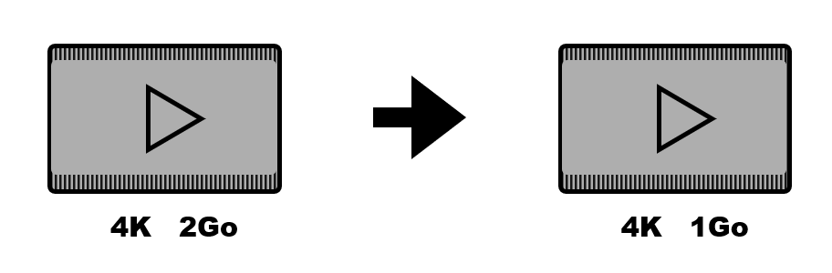
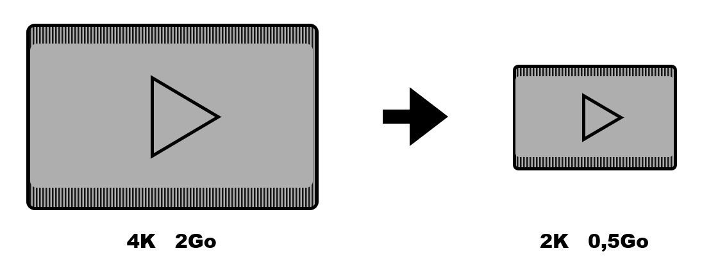
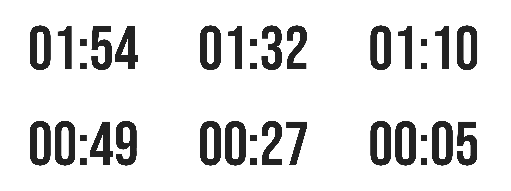
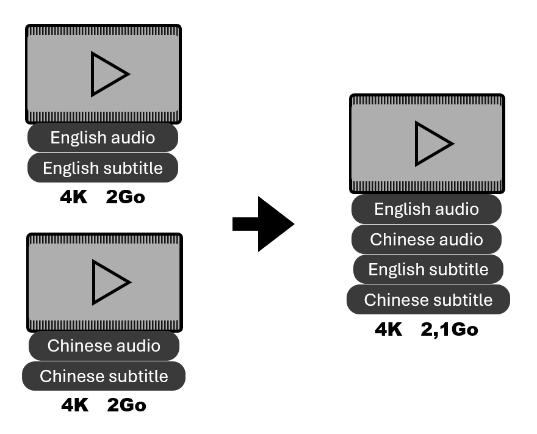

<div align="center">

#  VideoScripy

[**English**](./README.md) | **中文简体**

**画质无损，空间节省。**

视频压缩、流处理、AI放大 与 AI插帧 等视频处理的合集。


</div>


## 目录

- [系统要求](#系统要求)
- [整合包安装](#整合包安装)
- [手动安装](#手动安装)
- [视频处理说明](#视频处理说明)
- [致谢](#致谢)


## 系统要求

- Windows 操作系统
- NVIDIA 显卡（加速视频处理）
- 至少 50GB 空间用于AI放大处理 | AI插帧处理需 10GB
- Python 3.10
- [工具](#下载与安装-1)


## 整合包安装

最简单的方式，Python 和工具都已配置好。  
优点：**适合小白**

### 下载与安装

下载并解压 [整合包](https://github.com/luewh/Video-Script/releases/latest)

### 使用方式

运行 `VideoScripyWebUI.bat` 文件


## 手动安装

需要下载源码、安装 Python 及其依赖，下载工具并放入 tools 文件夹或添加到系统 PATH。  
优点：**自由**

### 下载与安装

1. 下载源码并解压。

2. 如果未安装 Python 3.10，请安装。

3. 安装依赖：
    ```shell
    pip install -r requirements.txt
    ```

4. 工具下载：

    [FFmpeg](https://www.gyan.dev/ffmpeg/builds/) 全功能版本用于硬件加速  
    [Real-ESRGAN-ncnn-vulkan](https://github.com/xinntao/Real-ESRGAN-ncnn-vulkan/releases) 用于视频放大  
    [Ifrnet-ncnn-vulkan](https://github.com/nihui/ifrnet-ncnn-vulkan/releases) 用于视频插帧  
    [NVEncC](https://github.com/rigaya/NVEnc) 用于检测 GPU 功能

5. 工具路径添加：

    创建 ”tools” 文件夹并放入所有工具，具体如下：
    ```
    VideoScripy
    │   ...
    │   VideoScripyWebUI.py 
    └───tools
    │   └───ffmpeg-full_build
    │   │   │   ...
    │   │   └───bin
    │   │       │   ffmpeg.exe
    │   │       │   ffprobe.exe
    │   └───Real-ESRGAN
    │   │   │   ...
    │   │   │   realesrgan-ncnn-vulkan.exe
    │   └───Ifrnet
    │   │   │   ...
    │   │   │   ifrnet-ncnn-vulkan.exe
    |...
    ```

    或者添加到系统环境变量*PATH*中，具体如下：
    - `<pathTo>\ffmpeg-full_build\bin`
    - `<pathTo>\Real-ESRGAN`
    - `<pathTo>\Ifrnet`
    - `<pathTo>\NVEnc`

### 使用方式

运行 `VideoScripyWebUI.py` 文件


## 视频处理说明

- 压缩  
    降低视频码率，节省存储空间
    <details>
    <summary>点击展开</summary>
        处理后的视频将具有以下比特率：比特率 = 宽 × 高 × 质量。
        通常， 质量=3 是画质不会出现明显下降的最小值，质量3与6在人眼下无显著差异。 
    </details>
    
    

- 尺寸调整  
    降低视频的宽度和高度。
    
    


- AI放大  
    使用 AI 将视频尺寸按2、3、4倍提升，同时增强画质。  
    支持从上次未完成的帧继续处理，如果 "_upscaledx?_frame" 文件夹未删除。
    <details>
    <summary>点击展开</summary>
        先将视频转为图像帧，逐帧放大后再重新合成为视频。 
    </details>
    
    <ins>原视频 : 266x200</ins>

    

    <ins>2倍放大 : 532x400</ins>

    

    <ins>3倍放大 : 798x600</ins>
    
    

    <ins>4倍放大 1064x800</ins>
    
    
    
- AI插帧  
    提高视频帧率，使视频更流畅 
    <details>
    <summary>点击展开</summary>
        先将视频转为图像帧，在帧之间插入中间帧，最后重新合成为视频。
    </details>

    <ins>插帧：25帧 -> 60帧</ins>
    
    
    
    
    由于 markdown 限制，60帧 动图可能会以0.5倍速播放，请使用合适播放器查看。

- 预览  
    生成图像网格预览

    <ins>2 分钟倒计时视频的 3x2 预览 </ins>
    
    


- 视频流  
    合并多个视频的不同流（视频、音频、字幕）为一个文件。  
    并可修改标题、语言等元信息。  
    使用 PotPlayer 等播放器可切换音视频流。 

     


## 致谢

本项目使用了以下开源工具和项目：
- [alive-progress](https://github.com/rsalmei/alive-progress)
- [Real-ESRGAN](https://github.com/xinntao/Real-ESRGAN)
- [IFRNet](https://github.com/ltkong218/IFRNet)
- [FFmpeg](https://www.ffmpeg.org/)
- [FFmpeg-python](https://github.com/kkroening/ffmpeg-python)
- [Dash](https://dash.plotly.com/)
- [NVEncC](https://github.com/rigaya/NVEnc)

音效素材来源：
- [Pixabay](https://pixabay.com/sound-effects/search/typewriter/)


